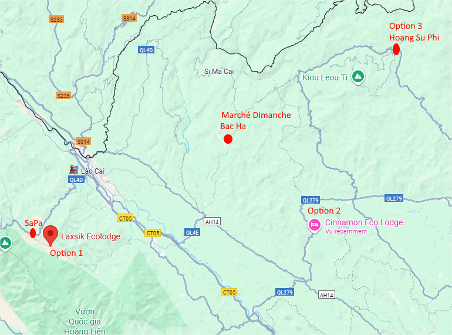

# Vietnam

 
|                        |     | Jour                                  | Nuit                                 |
| ---------------------- | --- | ------------------------------------- | ------------------------------------ |
| samedi 18 avril 2026   | 🛬  | Avion                                 | Avion                                |
| dimanche 19 avril 2026 | 🏮  | Arrivée Hanoï                         | Hanoï                                |
| lundi 20 avril 2026    | 🛥️ | Transfer Hanoï ➜ Halong Croisière | Bateau                               |
| mardi 21 avril 2026    | 🛥️ | Croisière                             | Bateau                               |
| mercredi 22 avril 2026 | 🛥️ | Croisière Transfer Halong - Hanoï | Hanoï                                |
| jeudi 23 avril 2026    | 🏮  | Hanoï                                 | **Hanoi** ou Train de Nuit ➜ Lao Caï |
| vendredi 24 avril 2026 | 🌄  | Nord : Arrivée, ballade               | Nuit Hotel Nord                      |
| samedi 25 avril 2026   | 🌄  | Nord : Randonnée Riziere              | Nuit Hotel Nord                      |
| dimanche 26 avril 2026 | 🌄  | Nord : Excursion marché Bac Ha        | Nuit Hotel Nord                      |
| lundi 27 avril 2026    | 🌄  | Nord : Ballade + retour               | **Hanoi** ou Train de Nuit ➜ Hanoï   |
| mardi 28 avril 2026    | 🏮  | Hanoï                                 | Hanoi                                |
| mercredi 29 avril 2026 | 🏞️ | Transfert vers MinBin                 | Ninh Bình                            |
| jeudi 30 avril 2026    | 🏞️ | Ninh Bình                             | Ninh Bình                            |
| vendredi 1 mai 2026    | 🏞️ | Ninh Bình                             | Train de Nuit ➜ Hué (21h30 -> 09h15) |
| samedi 2 mai 2026      | 🪷  | Hué                                   | Hué                                  |
| dimanche 3 mai 2026    | 🪷  | Hué                                   | Hué                                  |
| lundi 4 mai 2026       | 🪷  | Excursion Hoi An                      | Hué                                  |
| mardi 5 mai 2026       | 🪷  | Hué                                   | Train de Nuit ➜ Hanoï (20h30 -> 11h) |
| mercredi 6 mai 2026    | 🏮  | Hanoï                                 | Hanoï                                |
| jeudi 7 mai 2026       | 🏮  | Hanoï                                 | Hanoï                                |
| vendredi 8 mai 2026    | 🏮  | Hanoï                                 | Hanoï                                |
| samedi 9 mai 2026      | 🛬  | Transfer aeroport Hanoï               | Avion                                |

### Croisière

- https://www.indochina-junk.com/ --> mail sent
	- bateaux petits : 4 chambre ou 10 chambres --> Prix ???
	- Halong Bay and Bai Tu Long Bay Cruise : https://www.indochina-junk.com/halong-bay-bai-tu-long-bay-cruise-3-days-2-nights/
	- sur bateau : Prince Junk  (4 cabins) or Dragon’s Pearl Junk  (10 cabins)	- 

- www.bhayacruises.com --> mail sent
	- Bateaux petits : 5 chambre : Bhaya Legend --> 2 cabine  3 jour 2 nuit, Bay Halong - 2640 $ ( aka 660 $ / personne pour les 3 jours avec transport )
		-  With its spacious suite and quality facilities, the Bhaya Legend Private Cruise is a marriage between traditional Asian artistry and modern occidental style, a dream ship purpose-built to create magical and unforgettable memories.
		- The 20-square-meter premier suite is fully equipped with high-class hand-made furniture and a well-appointed en-suite bathroom. The suite features its own private balcony to enjoy magical views of Halong Bay.
		- Air Conditioner / Wifi in Common Area / King Size Bed / Private Balcony / Telephone / Walk-in Shower / Toiletries / Towels / Hair Dryer
	- https://bhayacruises.com/halong-bay-cruises/3-day-2-night-tour/3-days-private-cruise-bai-tu-long-bay-package?check_in_date=2026-04-21&cabins=2_0_0%2C2_0_0

- www.alisacruise.com --> mail sent
	- Bateau pas petit : Alisa Premier Cruise 22 room - 2 x 644 $ + 140 $ (transfer) == 1428 $ 
	- https://www.alisacruise.com/en/tour/alisa-premier-cruise-3-day-2-nights

- www.swancruiseshalong.com --> mail sent
	- Bateau pas petit --> Prix ???
	- Bai Tu Long Bay Swan Cruises 3 Days 2 Nights 
	- https://swancruiseshalong.com/itinerarie/bai-tu-long-bay-swan-cruises-3-days-2-nights

See [more here](Vietnam_Cruise.md)

### Nord

Option 1 : Trip autour de Sapa
- Jeudi soir : Train de Nuit (23:30 -> 06:00)
- Vendredi : Transport vers hotel, ballade dans rizière, repos
	- Hotel Laxsik Ecolodge Sapa : 90€ / nuit // https://www.tripadvisor.fr/Hotel_Review-g311304-d19354347-Reviews-Laxsik_Ecolodge_Sapa-Sapa_Lao_Cai_Province.html
- Samedi : Randonnée rizière à la journée
- Dimanche: Excursion marché de Bac Ha (⚠️ 2 x 3h de route)
- Lundi : Randonnée puis train de nuit ( 21:30 -> 05:30)

Option 2 : 4 jours en famille au Cinnamon Ecolodge en détails --> request  sent
- Vendredi – Départ d’Hanoi (Transfer = 3h30/4h) et fin de journée tranquille
- Samedi – Randonnée le matin, déjeuner chez l’habitant et fin d’après-midi tranquille
- Dimanche – Marché des minorités - Bac Ha
- Lundi  – On coupe de la cannelle et on rentre

Option 3 : 4 jours autour de Hoang Su Phi
- Vendredi – Départ d’Hanoi et fin de journée tranquille
- Samedi – Randonnée
- Dimanche – Marché des minorités
- Lundi  – Retour
- Hotel beaucoup plus root, transfer / route assez longue : 8h

See [more here](Vietnam_Nord.md)

### Hanoi

Quartier de Hoan Kiem

https://www.tripadvisor.fr/Hotels-g293924-Hanoi-Hotels.html
 
- Hanoi Le Jardin Hotel & Spa - 76 € / nuit et par chambre
	- https://www.tripadvisor.fr/Hotel_Review-g23068219-d16827967-Reviews-Hanoi_Le_Jardin_Hotel_Spa-Ba_Dinh_Hanoi.html
- Hanoi Tirant Hotel - 76 € / nuit et par chambre
	- https://www.tripadvisor.fr/Hotel_Review-g293924-d1951646-Reviews-Hanoi_Tirant_Hotel-Hanoi.html
- Hanoi Allure Hotel - 73 € / nuit et par chambre
	- https://www.tripadvisor.fr/Hotel_Review-g293924-d13292837-Reviews-Hanoi_Allure_Hotel-Hanoi.html
- La Siesta Classic Ma May Hotel - 102 € / nuit et par chambre
	- https://www.tripadvisor.fr/Hotel_Review-g293924-d7180030-Reviews-La_Siesta_Classic_Ma_May_Hotel-Hanoi.html

See [more here](Vietnam_Hanoi.md)

### Nimh Binh

A voir

See [more here](Vietnam_NimhBinh.md)

### Hué

A voir

See [more here](Vietnam_Hue.md)

